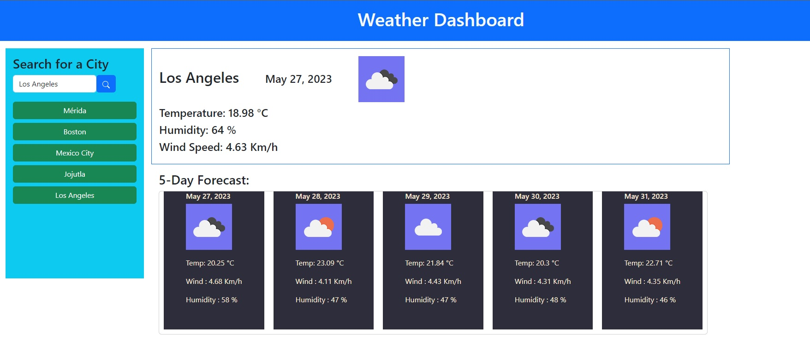

# Ray's Weather Dashboard

## Description

This challenge was to create dashboard that provides weather conditions for cities. The user can enter a city name and it will search for and match the closest city with that name. It will provide current conditions in addition to a 5-day forecast. The dashboard stores the city in a list on the left side and as the user searches for more cities they will be added to the list. The user is able to click cities that appear on the list to switch between them.

## Installation

Just click the application link

## Usage

Just get the page, insert the city in the input text and click for search. The city will be stored below the input text and will add the cities that the user was looking for so the user can switch between them.

## GithubLink
https://github.com/rponce23/rays-weather-dashboard

## Application Link
https://rponce23.github.io/rays-weather-dashboard/

